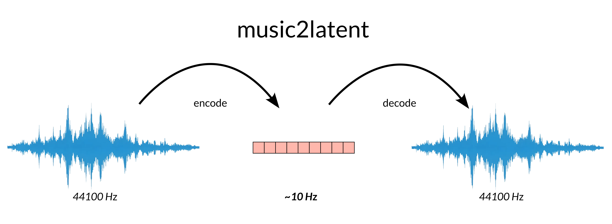

# Music2Latent
Encode and decode audio samples to compressed representations! Useful for efficient generative modelling applications and for other downstream tasks.



Read the ISMIR 2024 paper [here](https://arxiv.org/).

Under the hood, __Music2Latent__ uses a __Consistency Autoencoder__ model to efficiently encode and decode audio samples.
44.1 kHz audio is encoded into a sequence of __~10 Hz__, and each of the latents has 64 channels.
You can then train a generative model on these embeddings, or use them for other downstream tasks.

Music2Latent was trained on __music__ and on __speech__. Refer to the [paper](https://arxiv.org/) for more details.


## Installation

   ```bash
   pip install music2latent
   ```
The model weights will be downloaded automatically the first time you run the code.


## How to use
To encode and decode audio samples to/from latent embeddings:
   ```bash
   audio_path = librosa.example('trumpet')
   wv, sr = librosa.load(audio_path, sr=44100)

   from music2latent2 import EncoderDecoder
   encdec = EncoderDecoder()

   latent = encdec.encode(wv)
   # latent has shape (batch_size/audio_channels, dim (64), sequence_length)

   wv_rec = encdec.decode(latent)
   ```
If you need to extract encoder features to use in downstream tasks, and you don't need to reconstruct the audio:
   ```bash
   features = encoder.encode(wv, extract_features=True)
   ```
These features are extracted before the encoder bottleneck, and thus have more channels (contain more information) than the latents used for reconstruction.

music2latent2 supports more advanced usage, inclusing GPU memory management controls. Please refer to __tutorial.ipynb__.


## License
This library is released under the CC BY-NC 4.0 license. Please refer to the LICENSE file for more details.


This work was conducted by [Marco Pasini](https://twitter.com/marco_ppasini) during his PhD at Queen Mary University of London, in partnership with Sony Computer Science Laboratories Paris.
This work was supervised by Stefan Lattner and George Fazekas.